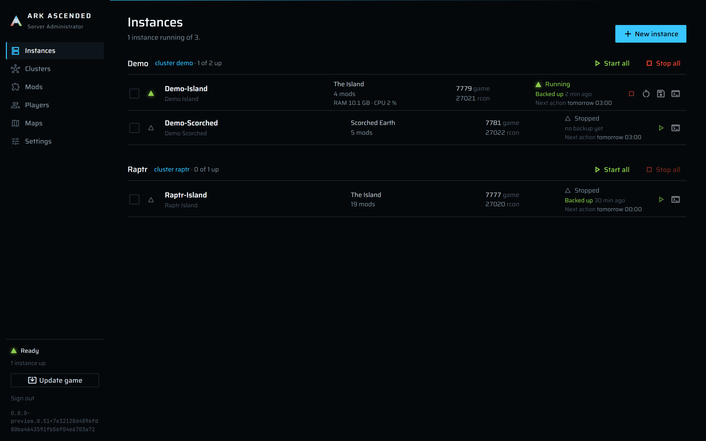
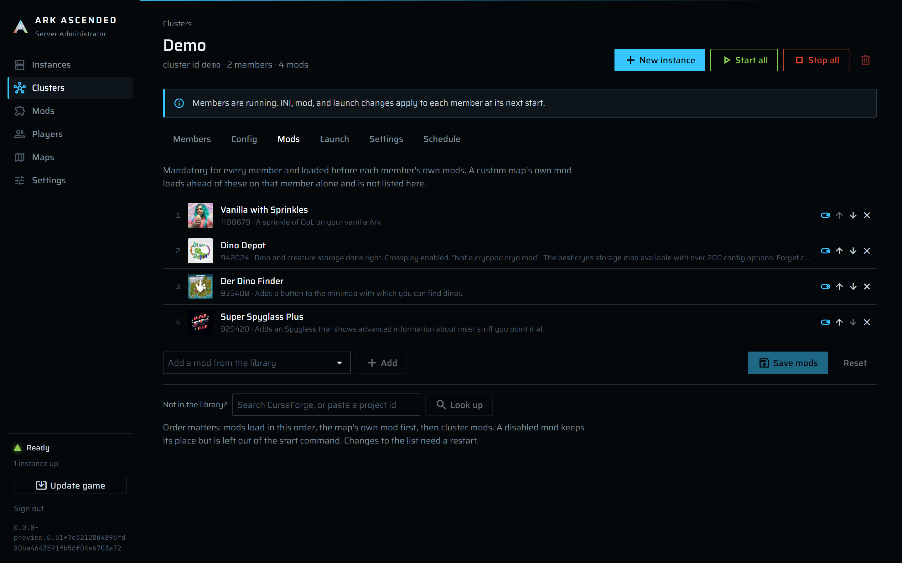
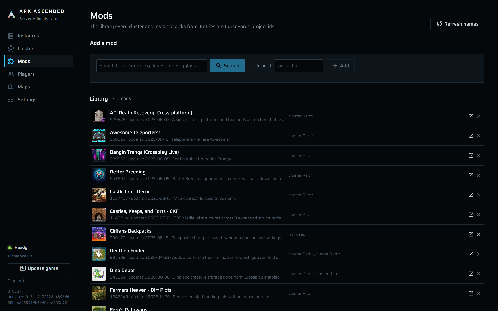
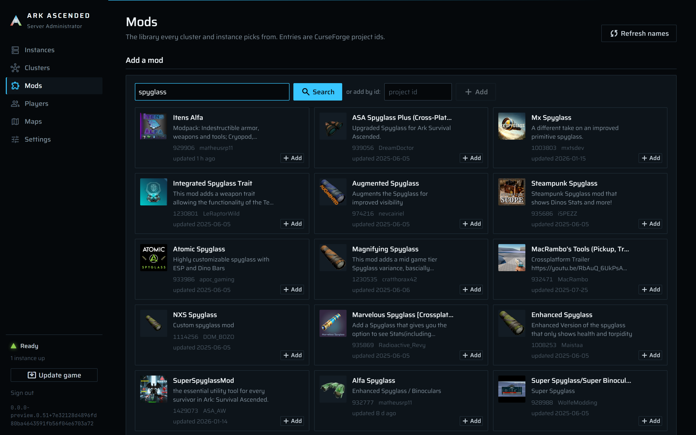

# Ark Ascended Server Admin

Self-hosted manager for **ARK: Survival Ascended** dedicated servers on Windows. It runs as a
Windows service on the game box and is operated from a browser, so you never have to remote-desktop
in to start, stop, update, or back up your servers.

Built for one owner running a handful of servers, clustered or standalone, on one machine.



This is a personal project I run for my own servers. Issues are read; fixes and features land when I
have the time and bandwidth. No schedule, no guarantees.

Not affiliated with, sponsored by, or endorsed by Studio Wildcard or Snail Games. ARK: Survival
Ascended and related marks are trademarks of their respective owners.

## What it does

SteamCMD installs the game once under `DataRoot\Server`, and every instance runs those same binaries
through its own NTFS junction tree with a private `Saved` folder, so updates happen once and worlds
never mix. On top of that:

- A wizard creates an instance (name, cluster, map, INI starting point, mods, launch options, ports)
  and can start it straight away. Clusters share INI files, mods, base launch options, an admin
  whitelist, and a transfer directory.
- `Game.ini` and `GameUserSettings.ini` are edited as plain text and kept as the source of truth on
  disk, mirrored into the database. Per-instance overrides sit on top. The manager fills in only
  what it owns (session name, ports, RCON, player cap) and warns when your text contradicts it.
- Start goes through a stagger queue and a port check against live OS listeners; stop broadcasts a
  countdown, asks the server to save and exit over RCON, and verifies the exit. A restarted service
  re-attaches to servers that kept running.
- Each server's `ShooterGame.log` is tailed live in a console, with startup markers and an RCON
  input.
- Every backup is checked: `saveworld`, wait for the files to settle, snapshot, zip, verify every
  entry, then prune to the retention count. Skipped or failed attempts are recorded, never silent.
- A game update stops everything with verified exits, runs SteamCMD, verifies the manifest,
  relaunches through the queue, and persists every step, so an interrupted update resumes after a
  service restart.
- Mods come from CurseForge (search with an API key, or add by id). Players are recorded from the
  game log as they join and leave, with an on-demand `ListPlayers` per instance. There are custom
  maps too, and a config export of the database.

| | |
|---|---|
| The live game log, with the RCON command list open. | Mods set on a cluster apply to every member. |
|  |  |
| The mod library and where each mod is in use. | Searching CurseForge from the Mods page. |
|  |  |

## What it does not do

These are decisions, not gaps waiting for time. If you are about to open an issue for one of them (or
something close), read the reason first; a request that changes the reasoning is welcome, a request
that repeats the feature will be closed with a link here.

- Translations. The UI is English only. Every string sits inline in the pages, and a wrong
  translation of a destructive button is worse than English. Reconsidered only if a contributor offers
  and maintains a complete translation.
- A Discord bot. One-way notifications to a Discord channel are planned; two-way control from
  Discord is not. The web UI already works from a phone, and a bot needs its own authentication story
  for a single-password app.
- Ban lists. The game keeps one `BanList.txt` for the whole install, in the shared
  `ShooterGame\Binaries\Win64`, rewrites it from memory on every `BanPlayer` and `UnbanPlayer`, and
  never reads it back while running. There is no honest way to keep a per-instance or per-cluster
  list, so the manager leaves the file alone. A ban sent from any instance console applies to every
  server on the box; see the players guide.
- Updating itself from inside the app. The service cannot safely replace its own binaries while
  running. The installer script owns upgrades, with a journal and rollback; the app will only tell you
  that a newer release exists.
- UPnP. Many routers disable it, leases expire or vanish on a router reboot, and it would need a
  re-announce loop and honest failure reporting. Each instance shows its game port, which is the one
  to forward; Tailscale or ZeroTier are documented alternatives.
- AsaApi plugin management. Every instance shares one `ShooterGame\Binaries` folder through a
  junction, so a hand-installed loader lands on every server at once. That layout is untested with
  AsaApi and the app does not install, list, or launch through it.
- Managing servers on other machines. One box, one service, one install. A remote-agent design
  would change nearly every layer.
- Tribe and player data tools. Character snapshots, single-player restore, and reading
  `.arkprofile` or `.arktribe` files are out of scope.
- Map rotation. Event-server behavior, not something a home cluster needs.
- SFTP or S3 backup targets. A planned "copy verified backups to this folder" setting works with
  any mounted drive, NAS share, or sync client; the app will not carry cloud SDKs or credentials.
- Looking up your public IP or probing reachability. Both need an outside service. You type your
  public address once; the app prints the `open` command.
- IIS. Kestrel as a Windows service is the deployment that is tested. IIS is untested and
  expected to break; [hosting.md](docs/hosting.md#iis) says why.

## Documentation

- [User guide (start here)](docs/guide/README.md): the pages, what each control does, and the
  everyday tasks from first login to the first backup.
- [Hosting](docs/hosting.md): bind modes, reverse proxy examples (Nginx Proxy Manager, Caddy),
  the certificate, the event log, upgrading and rolling back, changing the password, uninstalling,
  and the IIS note.
- [Configuration](docs/configuration.md): every host setting, what the installer writes, hashing
  the password, file permissions, and the App Settings kept in the database.
- [Exposing servers to players](docs/exposing-servers.md): which port has to be reachable, the
  three shapes that work (router forward, cloud VM, Tailscale or ZeroTier), and the tunnels that do
  not.
- [What happens when you create an instance](docs/instance-creation.md): every step behind the
  wizard's **Create instance** button and the **Start the server right away** option.

## Install from a release

Requirements: 64-bit Windows 10, Windows 11, or Windows Server; an administrator account; about
15 GB of disk for the game install plus whatever your worlds and backups grow to. Windows 11 is
what the releases are tested on.

Each release on the [Releases page](https://github.com/heloraptr/Ark-Ascended-Server-Admin/releases)
carries two zips and a `SHA256SUMS` file:

| Zip | Size | Needs |
|---|---|---|
| `ArkAscendedServerAdmin-<version>-win-x64.zip` | about 110 MB | Nothing. The .NET runtime is inside. |
| `ArkAscendedServerAdmin-<version>-win-x64-fdd.zip` | about 20 MB | The [ASP.NET Core 10 runtime](https://dotnet.microsoft.com/download/dotnet/10.0) installed on the box (the hosting bundle or the runtime; the SDK includes it). The installer checks and stops with the link if it is missing. |

Take the first one unless you already keep .NET installed.

1. Download the zip. Optionally check it: `Get-FileHash .\ArkAscendedServerAdmin-1.0.0-win-x64.zip`
   against `SHA256SUMS`.
2. Unblock it before extracting, or the scripts inside are refused by the execution policy:
   right-click the zip, Properties, tick **Unblock**, or `Unblock-File .\ArkAscendedServerAdmin-1.0.0-win-x64.zip`.
   Then extract it anywhere; the folder is only the source to copy from.
3. Run the installer elevated. Start, type `powershell`, *Run as administrator* (Windows
   PowerShell 5.1 is enough; PowerShell 7 works too), then:

   ```powershell
   cd C:\Users\you\Downloads\ArkAscendedServerAdmin-1.0.0-win-x64
   .\install.ps1
   ```

4. Answer the prompts. Each one has a default and can be given as a parameter instead:

   | Prompt | Parameter | Default |
   |---|---|---|
   | Where the app goes | `-InstallDir` | `C:\ArkAscendedServerAdmin\App` |
   | Where the data goes (the 12 GB game install, instances, worlds, backups, database) | `-DataRoot` | `C:\ArkAscendedServerAdmin` |
   | The login password | `-Password` | prompted, masked |
   | How the web UI is reached | `-Bind Loopback`, `LanHttps`, or `Proxy` | `Loopback` |
   | Port | `-Port` | 5000 (`Loopback`, `Proxy`), 5001 (`LanHttps`) |

   `-Quiet` answers nothing and fails on a missing required value, for scripted installs:
   `.\install.ps1 -Bind LanHttps -Password 'a long one' -Quiet`.

   The installer copies the files, hashes the password (the plain text is never written to disk),
   writes `appsettings.Production.json` readable only by SYSTEM and administrators, locks down both
   folders, registers the `ArkAscendedServerAdmin` service under LocalSystem, starts it, and checks
   that it answers.

5. Open the URL. With `LanHttps` it is `https://<box-ip>:5001/`, behind a self-signed
   certificate the browser will warn about. With the default `Loopback` there is no URL yet: the
   app listens on `http://127.0.0.1:5000` for a reverse proxy on the same box that terminates HTTPS,
   forwards `X-Forwarded-Proto`, and passes WebSockets; a direct `http://` request answers 403 by
   design. [hosting.md](docs/hosting.md) has the three modes and proxy examples.
6. Wait for `/setup`. Every page shows the SteamCMD console until the game install under
   `DataRoot\Server` is downloaded and verified: 12 GB, roughly 20 minutes on a fast line. Then log
   in with the password and create the first instance.

Upgrading is the same command from a newer zip; the installer keeps the previous version and a
database copy until the upgrade is verified. Changing the password is `.\install.ps1 -SetPassword`.
Removing the app is `.\uninstall.ps1`, which leaves `DataRoot` and everything in it. All of that is
in [hosting.md](docs/hosting.md).

## Build from source

Requires the .NET 10 SDK (see `global.json`). To produce the same zips a release carries:

```powershell
.\build\publish-release.ps1
```

It builds, runs both test executables, publishes the self-contained and framework-dependent
variants, and stages each with `install.ps1`, `uninstall.ps1`, `INSTALL.md`, `LICENSE`, and
`THIRD-PARTY-NOTICES.md`. Run `install.ps1` from a staging folder exactly as from a downloaded zip.
The version comes from the nearest `v*` git tag through MinVer; an untagged checkout builds as a
`0.0.0-preview` version and installs like any other.

For running the app straight from the repository without installing, see
[Running from the repo](#running-from-the-repo).

## Configuration

Settings come in two kinds, and they are kept apart.

**Host settings** live in `appsettings.Production.json` next to the executable (the installer writes
it), or in environment variables on the service, and need a service restart to change. The ones you
are likely to touch:

| Key | Purpose | Default |
|---|---|---|
| `ArkAdmin:DataRoot` | Root of all managed data: game install, instances, clusters, backups, archive, database, keys, exports. | `%ProgramData%\ArkAscendedServerAdmin` when empty; the installer sets `C:\ArkAscendedServerAdmin` |
| `ArkAdmin:PasswordHash` | The login password as a PBKDF2 string, produced by running the exe with `--hash-password` (plain text on standard input). The installer writes this. | *(empty)* |
| `ArkAdmin:Password` | The login password in plain text. For development, or anyone who prefers it. When both are set, `PasswordHash` wins and a warning is logged. Neither set refuses every login. | *(empty)* |
| `ArkAdmin:KnownProxies` | IP addresses of reverse proxies whose `X-Forwarded-*` headers are trusted. Loopback is always trusted. | `[]` |
| `ArkAdmin:AllowInsecureHttp` | Accept plain-HTTP requests. Development only; otherwise any request that is not HTTPS after forwarded-header processing gets 403. | `false` |
| `Kestrel:Endpoints:*` | Bind addresses and the HTTPS certificate; set by the bind mode. | `http://127.0.0.1:5000` |

The full table, the file the installer writes for each bind mode, hashing a password by hand,
environment variables, and the file permissions are in [configuration.md](docs/configuration.md).

**App Settings** live in the database and are edited on the Settings page at runtime: stagger
delay, SteamCMD `validate`, port start and step for suggestions, default backup interval and
retention, backup quiescence, pre-stop broadcast minutes, graceful stop timeout, RCON timeout,
console backfill lines, the manager-wide admin whitelist, and the CurseForge API key. The key is
your own and subject to CurseForge's API terms, and it is **stored in plain text in the database**;
the database folder is readable only by SYSTEM and administrators after install, and every config
export contains it.

### Security model

Kestrel binds to loopback by default; the owner's reverse proxy terminates HTTPS and forwards to
it. The app also refuses any request whose effective scheme is not HTTPS, so a LAN rebind without
the proxy fails closed. The `LanHttps` mode gets its HTTPS from a self-signed certificate instead.

Authentication is one password with a 12-hour sliding cookie named `ArkAscendedServerAdmin.Auth`.
The password is stored as a PBKDF2 hash, the hash is validated on every request and every Blazor
circuit is revalidated every five minutes, and every command re-checks the session server-side
before doing anything. The cookie key ring is DPAPI-protected for the service account.

The service runs as LocalSystem so firewall rules, WMI, and junctions need no separate elevation;
RCON never leaves loopback. `GET /healthz` is the one anonymous endpoint: plain text
`ArkAscendedServerAdmin ok`, no version, no state, for the installer's probe and for monitoring.

### Data layout

```
DataRoot\
  App\               the installed app (InstallDir, by default); App.previous-<ts>\ after an upgrade
  Server\            the game install (SteamCMD target); Server\steamapps\appmanifest_2430930.acf proves it
  SteamCMD\          steamcmd.exe, downloaded on first run
  Instances\<slug>\  per-instance junction tree, source INI (standalone), private ShooterGame\Saved
  Clusters\<slug>\   cluster source INI and the transfer directory
  Backups\<slug>\    verified world backups
  Backups\_app\      database copies taken by the installer before each upgrade
  Archive\           retained worlds of deleted instances (slug stays reserved while present)
  Exports\           "export config backup" copies of the database
  keys\              Data Protection key ring, the LanHttps certificate (web-<ts>.pfx), the installer's journal
  Data\              ArkAscendedServerAdmin.db (SQLite, WAL mode)
```

## Web UI

Every screen lives in the `Components` Razor Class Library and talks only to `Core` interfaces:
the scoped command facades (`IInstanceCommands`, `IClusterCommands`, `IConfigCommands`,
`IModCommands`, `IPlayerCommands`, `IMapCommands`, `ISettingsCommands`, `IMaintenanceCommands`)
re-check the session on every call, and live state (instance runtimes, console lines, readiness,
maintenance) is observed through the singleton services' events.

| Page | What it does |
|---|---|
| Instances (`/`) | Rows grouped by cluster, standalone last; start/stop/restart/back up per row, selected, or per cluster; update-recovery banner with retry/skip. |
| Instance (`/instances/{id}`) | Console with RCON input, a Players tab that asks the server who is on (`ListPlayers`), INI editors (source files) and overrides, mods, launch options with a command-line preview, settings with a whitelist editor, backups. |
| New instance (`/instances/new`) | Wizard: name, cluster, map, INI starting point and admin password, mods, launch options, ports, summary with "start right away". |
| Clusters | Shared INI files, cluster mods, base launch options, cluster id and whitelist. |
| Mods | CurseForge search with an API key, manual ids without one, usage per cluster, instance, and custom map. A custom map's own mod is tagged and can only be added through the map. |
| Players | Everyone who has joined a server, recorded from the log as it happens: online or last seen, where, platform, EOS id; pick an id into a whitelist. |
| Maps, Settings, Setup | Map list with type (official story, official non-canon, custom/mod), release date, and a custom map's mod id; App Settings (including the manager-wide admin whitelist) plus read-only host values, the app version, and config export; install console. |
| Update (`/update`) | Installed build, a "verify game files" switch, the SteamCMD console, and the run's outcome: already current, or updated from one build to another. The sidebar's "Update game" button lands here. |

The visual system (fonts, tokens, the horizon rule, the state indicator) is in
`src/ArkAscendedServerAdmin.Components/wwwroot/css/ark.css`; Radzen's `standard-dark` theme is
re-tokened rather than restyled.

## Repository layout

| Project | Role |
|---|---|
| `src/ArkAscendedServerAdmin.Core` | Domain models, INI and launch-argument logic, port allocation, the update state machine, CurseForge client, service interfaces. No Windows dependencies. |
| `src/ArkAscendedServerAdmin.Infrastructure` | EF Core + SQLite, SteamCMD, process management and reconciliation, RCON, junction layout, firewall, backups, update flow. Windows only. |
| `src/ArkAscendedServerAdmin.Components` | Razor Class Library with every screen (Radzen). |
| `src/ArkAscendedServerAdmin.Server` | Blazor Server host, Windows service, the command facades. |
| `test/ArkAscendedServerAdmin.UnitTests` | Pure unit tests over `Core`. |
| `test/ArkAscendedServerAdmin.Infrastructure.IntegrationTests` | `Infrastructure` and command-facade tests on a real temp filesystem and SQLite database. Windows only. |
| `install/` | `install.ps1` and `uninstall.ps1`, shipped in both zips. |
| `build/` | `publish-release.ps1`, which produces the release zips. |
| `.github/workflows/` | CI on every push and pull request; a release on every `v*` tag. |

## Building and testing

Requires the .NET 10 SDK (see `global.json`). Package versions are managed centrally in
`Directory.Packages.props`; versions come from git tags via MinVer.

```
dotnet build ArkAscendedServerAdmin.slnx
dotnet run --project test/ArkAscendedServerAdmin.UnitTests/ArkAscendedServerAdmin.UnitTests.csproj --no-build
dotnet run --project test/ArkAscendedServerAdmin.Infrastructure.IntegrationTests/ArkAscendedServerAdmin.Infrastructure.IntegrationTests.csproj --no-build
```

The test projects are Microsoft.Testing.Platform executables, so `dotnet run` (or the built `.exe`)
runs them directly. With SDK 10.0.400 and xunit.v3 4.0.0, `dotnet test --project ...` reports
"Zero tests ran" for both projects; use `dotnet run` until that combination is sorted out. The
executables accept `--filter-namespace <namespace>` to run one folder.

The Windows-targeted projects (`Infrastructure`, `Server`, `Infrastructure.IntegrationTests`) build
and run on Windows; on Linux/WSL they compile with `-p:EnableWindowsTargeting=true` but cannot run.

### Running from the repo

`appsettings.Development.json` points `DataRoot` at `./data` in the repo (git-ignored), sets the
password to `dev`, and allows plain HTTP, so
`dotnet run --project src/ArkAscendedServerAdmin.Server` works without a proxy.

Startup only needs `DataRoot\Server\steamapps\appmanifest_2430930.acf` with
`StateFlags 4`, the game tree under `Server`, and `DataRoot\SteamCMD\steamcmd.exe`. With an existing
game install elsewhere, junction `Server\Engine` and `Server\ShooterGame` at it, copy the manifest
and `steamcmd.exe`, and `dotnet run` reaches Ready in a few seconds instead of downloading 12 GB.

### Database migrations

The `AppDbContext` and its migrations live in `Infrastructure`; `dotnet ef` is a local tool
(`.config/dotnet-tools.json`, run `dotnet tool restore` once):

```
dotnet ef migrations add <Name> --project src/ArkAscendedServerAdmin.Infrastructure --startup-project src/ArkAscendedServerAdmin.Server --output-dir Data/Migrations
```

Migrations are applied automatically at service start. "Export config backup" on the Settings page
writes a consistent copy with SQLite's online backup API; a raw copy of the `.db` file is only safe
with the service stopped, which is when the installer takes its copy before an upgrade.

## Notes on ASA specifics

- `-port=` is mandatory; the game ignores `Port` in the INI. `RCONPort`, `RCONEnabled`, and
  `ServerAdminPassword` are honored from the INI.
- The player cap is `-WinLiveMaxPlayers`; ASA ignores the INI `MaxPlayers` and resets it. The
  manager writes both from the one **Max players** field.
- ASA does not use the Steam query port. Each server still opens UDP 27015 as a vestigial Steam
  socket and several instances can share it; only the game port (UDP, plus port + 1) needs a
  firewall rule, and RCON stays on loopback. See [exposing-servers.md](docs/exposing-servers.md)
  for what has to reach the box from outside.
- `doexit` exits with code -1 every time; exit codes are never treated as crash signals.
- The game rewrites `GameUserSettings.ini` at launch and exit, which is why generated files are
  never read back as source.

## License

MIT, see [LICENSE](LICENSE). Third-party components and fonts are listed in
[THIRD-PARTY-NOTICES.md](THIRD-PARTY-NOTICES.md). Contributions: [CONTRIBUTING.md](CONTRIBUTING.md).
Vulnerabilities: [SECURITY.md](SECURITY.md).
