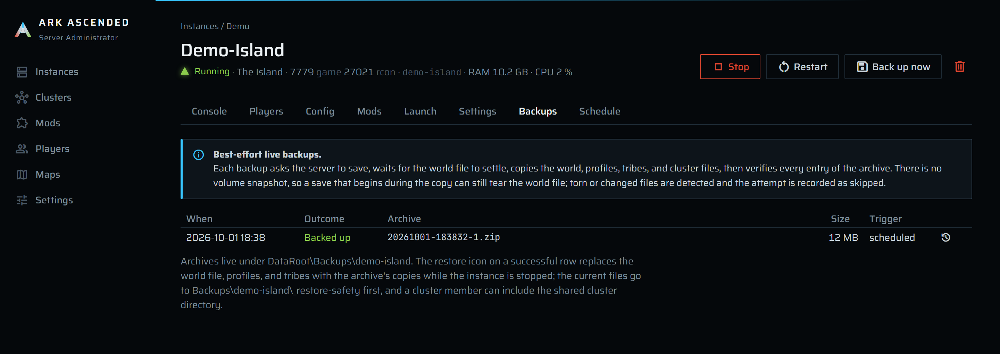

# Backups

The manager takes world backups of a running server without stopping it: it asks the server to
save over RCON, waits for the world file to settle, copies the world, profile, tribe, and cluster
files to a snapshot folder, zips them with a manifest, verifies every entry of the zip against the
manifest, and only then gives the archive its final name. Backups run on a per-instance interval
while the instance is running, or on demand. Every attempt is recorded, including the ones that
were skipped or failed, so a missed schedule is never silent. A successful archive can be restored from the same tab while the
instance is stopped; the files it replaces are kept aside and put back if the restore fails.

## What ends up in the zip

Only what a restore needs: `<MapKey>.ark`, `*.arkprofile`, and `*.arktribe` from the world folder,
plus the whole cluster directory for a cluster member. The game's own rolling copies (`*.arkrbf`,
`*_AntiCorruptionBackup.bak`) are never archived.

```
manifest.json
World/TheIsland_WP.ark
World/<eos id>.arkprofile
World/<tribe id>.arktribe
Cluster/...                     (cluster members only: the transfer directory, recursively)
```

The zips live in `DataRoot\Backups\<slug>\`, named `yyyyMMdd-HHmmss-<n>.zip` in local time, where
`<n>` starts at 1 and only climbs if two archives land in the same second. The manager keeps the
newest *N* successful archives per instance and deletes the rest; manual and scheduled backups count
alike.

## Running a backup by hand

On the instance page the header has a **Back up now** button next to **Stop** and **Restart**; it is
enabled only while the state is **Running**. The Instances page has the same action as the save icon
on each row. A toast says "Backing up *name*", then "Backed up" with the file name and size, or
"Backup skipped" / "Backup failed" with the reason.

## The schedule

Nothing to switch on. Once an instance reaches **Running**, the scheduler includes it at its
interval. The interval and retention come from the Settings page unless the instance overrides them:

| Where | Field | Default | Range |
|---|---|---|---|
| Settings, *Backups* | **Default interval, minutes** | 30 | 1 to 10080 |
| Settings, *Backups* | **Default backups to keep** | 10 | 1 to 1000 |
| Settings, *Backups* | **Settle window after saveworld, seconds** | 10 | 1 to 600 |
| Instance page, **Settings** tab | **Backup interval, minutes** | blank ("default from Settings") | 1 to 10080 |
| Instance page, **Settings** tab | **Backups to keep** | blank ("default from Settings") | 1 to 1000 |

The scheduler ticks once a minute. An instance is due when its newest record of any outcome is
older than its interval. A due `Running` instance gets a backup; a due `Unreachable` or
`StartingUnconfirmed` instance gets a skipped record so the missed schedule is visible; a stopped
instance is left alone. Two backups of the same instance never overlap.

## The Backups tab



The tab on the instance page lists every attempt, newest first, 20 per page, with the columns
**When**, **Outcome**, **Archive** (the file name, or the reason for a skip or failure), **Size**,
and **Trigger** (`manual` or `scheduled`). It updates on its own when a scheduled backup finishes. Each **Backed up** row has a restore
icon ([Restoring a backup](#restoring-a-backup)); below the list, **Restores** shows every restore
and recovery with its outcome and reason.
Before the first attempt it reads "No backups yet. They run every *N* minutes while the instance is
running, or on demand with Back up now."

Every attempt is recorded as **Backed up**, **Skipped**, or **Failed** with a reason, here and as
the last-backup line on the Instances page. A skipped or failed attempt is stored like a successful
one because the alternative, a schedule that quietly stops producing archives when RCON breaks, is
exactly the failure an owner discovers too late.

## One backup, step by step

Everything runs under the instance lock, so a backup waits behind a stop or a delete of the same
instance and vice versa.

1. **State check.** The instance must be `Running`. Anything else is recorded as skipped:
   `instance not running (<State>)`, or `RCON unreachable (<State>)` when the state is
   `Unreachable` or `StartingUnconfirmed`.
2. **RCON credentials** are read from the generated `GameUserSettings.ini` under
   `Instances\<slug>\ShooterGame\Saved\Config\WindowsServer\`.
3. **`saveworld`** over RCON, with the RCON command timeout from Settings. The server answers
   `World Saved`; any other reply is logged to the console as a warning and the backup continues
   with the world file as it is. A failed command is a skip.
4. **Settle.** The world file `ShooterGame\Saved\<slug>\<MapKey>\<MapKey>.ark` is polled every
   250 ms until it can be opened for shared reading and its length and last-write time have been
   stable for one second, or until the settle window runs out (then a warning goes to the service
   log and the backup continues). The reply to `saveworld` arrives before the file is rewritten,
   so the wait always starts unsettled.
5. **Inventory.** The selected files are listed with length and last-write time: from the world
   folder only `<MapKey>.ark`, `*.arkprofile`, `*.arktribe` (no subfolders); from
   `DataRoot\Clusters\<cluster slug>\` everything, recursively, for a cluster member.
6. **Snapshot by copy.** Each file is copied to `Backups\<slug>\.snap-<guid>\World\...` or
   `...\Cluster\...` while its SHA-256 is computed. The copy opens files with shared read access. If
   the game holds a file exclusively, the attempt is retried after one settle window, up to three
   times; the console shows "A world file is held by a writer (...); waiting *N* s before attempt
   *X* of 3."
7. **Re-inventory.** The files are listed again and compared. Any added, removed, or changed file
   means the snapshot cannot be trusted: the copy is discarded and the inventory is retried once
   ("Files changed during the snapshot (...); retrying the inventory once."). A second difference
   is a skip.
8. **Manifest.** `manifest.json` (instance slug, map key, cluster slug and whether the cluster folder
   was captured, creation time, every file with length and hash) is written into the snapshot folder.
9. **Zip.** The snapshot folder is zipped to `Backups\<slug>\.tmp-<guid>.zip` and the snapshot
   folder is deleted.
10. **Verify.** The zip is reopened and every manifest entry is read back and hashed; lengths and
    hashes must match, and `World/<MapKey>.ark` must be listed. A mismatch deletes the zip and
    records a failure. .NET's zip reader does not check CRCs on read, which is why the manager
    hashes instead.
11. **Rename** to the final `yyyyMMdd-HHmmss-<n>.zip` and record the result in the `BackupRecords`
    table (time, outcome, file name, size, manual or scheduled). The console shows
    `Backup written: <file> (<bytes> bytes).`
12. **Prune.** Successful records beyond the retention count are deleted, oldest first, file and
    row together. The console shows `Pruned <n> backup(s) beyond the retention of <r>.` Skipped and
    failed records hold no file and are never pruned by this rule.

## Why there is no volume snapshot

DESIGN.md asked for a per-instance `saveworld` followed by a zip of the save folder, on a manual
button and an in-manager interval that runs only while the instance is running, with a retention
count that manual backups share. That is what you get, minus one thing the manager cannot do: freeze
the disk. The game can start another save while the copy is in progress and tear the world file.
Rather than pretend otherwise, the backup inventories the files before and after the copy and records
a **Skipped** attempt when they moved; the next interval tries again. Verifying the zip against a
manifest closes the other gap, a zip that is written but not readable.

## Restoring a backup

The restore icon on a **Backed up** row opens `Restore <file>`. The dialog reads the archive first
and stops there if it cannot be restored: the manifest must name this instance and its current
map, every entry must be listed in the manifest with a matching hash, and the archive must hold
exactly one `World\<MapKey>.ark`. Then two choices:

- **Also restore the cluster data**, off by default. Available only for a cluster member whose
  backup was taken in the same cluster with the cluster directory present; otherwise the box is
  disabled with the reason. When ticked, everything under `DataRoot\Clusters\<slug>` is replaced
  with the archive's copy, every member of the cluster must be stopped, and all of them stay
  locked until the restore finishes.
- **Start after restore**, off by default.

The button reads **Restore**, or **Stop and restore** while the server is running: the normal stop
runs first, countdown included, and the restore begins once the process has exited.

What a restore does, in order:

1. Takes the instance lock (with cluster data: reserves the cluster, then takes every member's
   lock) and checks that every affected instance is **Stopped** (a **Crashed** instance counts as stopped). A running sibling or an operation
   in progress refuses the restore before anything is touched.
2. Copies the current world folder (and the cluster folder) whole to
   `DataRoot\Backups\<slug>\_restore-safety\<timestamp>-<n>\`. The last three safety copies per
   instance are kept.
3. Writes a journal under `DataRoot\Data\restore-journals\`, so an interruption is never silent.
4. Deletes the world file, every `.arkprofile` and `.arktribe`, and the game's own rolling copies
   (`*.arkrbf`, `*_AntiCorruptionBackup.bak`) from the world folder, and everything from the cluster
   folder when included, then extracts the archive. Other files in the world folder are not touched.
5. Removes the journal and records the outcome under **Restores** on the Backups tab. The console
   shows `Restored <file>; the previous files are at <safety copy>.`

If anything fails during step 4, the folders are cleared and the safety copy is copied back, so the
exact previous file set returns; the record says **Rolled back** with the reason.

### An interrupted restore

If the service stops during step 4, or the rollback itself fails, the journal stays. The instance
page (and the cluster page, for a restore that included cluster data) shows **Incomplete restore**
with the journal id. Starting, restoring, or deleting any affected instance, adding a member, and
deleting the cluster are refused with `An incomplete restore (<id>) references ...` until you choose:

- **Recover from safety copy**: takes the same locks, checks that the instances are stopped, and
  puts the files from before the restore back. The record says **Rolled back** with the safety-copy
  path.
- **Discard journal**: removes the journal and leaves the files exactly as they are, for the case
  where you have sorted the folders out by hand. The safety copy stays until it is pruned.

Nothing is recovered automatically; the service log lists any journal it finds at startup.

### When a restore is refused or fails

| Where | Message | Meaning and what to do |
|---|---|---|
| Dialog | `This backup cannot be restored.` with a reason | The archive fails a check: it belongs to another instance or map, an entry is missing, unlisted, or has a bad hash, or a name inside it is not a plain file name. Use another backup. |
| Dialog | **Also restore the cluster data** is disabled | The instance is standalone, the backup was taken before cluster data was recorded, or it was taken in a different cluster. A world-only restore still works. |
| Toast | `Could not restore <name>: Stop <name> (Running) first; ...` | An affected instance is not stopped. Stop it, or wait for the stop to finish. |
| Toast | `... An operation is in progress for <name>; ...` | A start, stop, backup, or delete holds the lock. Try again when it finishes. |
| Toast | `... is a junction or symbolic link; ...` | The world or cluster folder has been replaced by a link. A restore only writes to real folders. |
| Toast | `Restore failed and the previous files were put back: <reason>` | Step 4 failed (a locked file, a full disk) and the rollback succeeded. The record says **Rolled back**. |
| Banner | **Incomplete restore** | See [An interrupted restore](#an-interrupted-restore). |

## The installer's `Backups\_app` copies

`DataRoot\Backups\_app\<timestamp>-<old version>\` is written by `install.ps1` during an upgrade,
not by the app: with the service stopped it copies `ArkAscendedServerAdmin.db` (and the `-wal` and
`-shm` side files if present) from `DataRoot\Data\` so `install.ps1 -Rollback` can put the
database back if the new version fails its probe. The newest set is kept after a verified upgrade;
older ones are pruned. These folders are database copies, not world backups: they never appear on
a Backups tab, retention does not touch them, and they hold the CurseForge API key in plain text,
which is why the installer restricts them to `SYSTEM` and administrators.
[hosting.md](../hosting.md#upgrading) covers the upgrade and rollback flow.

## When a backup is skipped or fails

| Where | Message | Meaning and what to do |
|---|---|---|
| Button | **Back up now** is disabled | The instance is not `Running`. Start it, or wait for the RCON probe to confirm it. |
| Backups tab | `instance not running (Stopped)` | A scheduled attempt found the instance stopped. Normal after a stop; nothing to do. |
| Backups tab | `RCON unreachable (Unreachable)` or `(StartingUnconfirmed)` | The server is alive but RCON is not answering. Check `ServerAdminPassword` and `RCONPort` in the INI; see [console-and-rcon.md](console-and-rcon.md). |
| Backups tab | `RCON unreachable: the generated GameUserSettings.ini is missing` | The instance was never started by this manager, or `Saved\Config\WindowsServer` was deleted. Restart the instance. |
| Backups tab | `saveworld failed (Timeout): ...` | RCON timed out. Raise **RCON command timeout, seconds** on Settings if the server is busy; a server still starting takes several seconds per command. |
| Backups tab | `world file missing: <path>` | The server has not saved yet (a fresh world) or the map key changed. Wait for the first save. |
| Backups tab | `world file in use after 3 attempts: ...` | The game held the world file exclusively through three settle windows. Raise **Settle window after saveworld, seconds**, or back up when the server is quieter. |
| Backups tab | `files changed during the snapshot twice (...)` | A save began during the copy on two consecutive tries. Same fix. |
| Backups tab | `verification: <problem>` | The zip did not read back as written (a full or failing disk, usually). The zip was deleted; check the drive and the service log. |
| Backups tab | **Failed** with an I/O message | Disk full, permissions, or a folder in the way. The message is the OS error. |
| Toast | "Could not back up: Instance *N* does not exist." | The instance was deleted while the button was pressed. |
| Settings tab | "Backup interval must be between 1 and 10080 minutes, or left blank to use the default." | Fix the field or clear it. |
| Settings tab | "Backups to keep must be between 1 and 1000, or left blank to use the default." | Same. |

A skipped or failed attempt holds no zip, so it does not count against **Backups to keep**. Those
rows are capped on their own instead: each instance keeps its 50 most recent, and anything older is
dropped after the next backup, so a schedule that fails every time cannot bury the list.

## What happens to the zips when an instance goes

Deleting an instance asks whether to delete its backup archives, with the box ticked. Leave it
ticked and `Backups\<slug>\` goes with the instance; clear it and the zips stay on disk. The records
go with the instance row either way, so a kept zip can only be restored by hand: unzip it and copy
the files under `World` into `ShooterGameSaved<slug><MapKey>`. See
[instances.md](instances.md).
