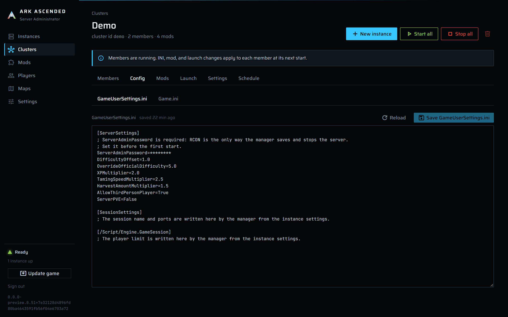

# Configuration files

`Game.ini` and `GameUserSettings.ini` are the two files ARK reads its rules from. The manager keeps
them as plain text on disk, mirrors them into the database, and generates the files the game actually
reads at every start from that source plus the instance's own fields and overrides.

## Source files and generated files

Two layers, kept apart:

| Layer | Path | Who writes it | Who reads it |
|---|---|---|---|
| **Source** | `Clusters\<slug>\Config\*.ini` (cluster) or `Instances\<slug>\Config\*.ini` (standalone) | You, in the INI editor or with any text editor | The manager, at every start and in the launch preview |
| **Generated** | `Instances\<slug>\ShooterGame\Saved\Config\WindowsServer\*.ini` | The manager, at every start (previous file kept as `.bak`) | The game |

Generating the files rather than launching the game on the source text is what lets a cluster share
one source while every member gets its own session name, ports, and cap.

Editing the generated files under `Saved\Config\WindowsServer` is pointless: they are overwritten at
the next start, and the game itself rewrites `GameUserSettings.ini` at launch and exit. Nothing the
game adds there is ever read back into the source.

## The six keys the manager writes itself

These come from the instance's settings; everything else is your text, passed through untouched:

| Key | Section | Value |
|---|---|---|
| `SessionName` | `[SessionSettings]` | The instance's **Session name** |
| `Port` | `[SessionSettings]` | The **Game port** (the game ignores this key and uses `-port=`; it is written so the file agrees with the launch line) |
| `RCONEnabled` | `[ServerSettings]` | `True`, always |
| `RCONPort` | `[ServerSettings]` | The **RCON port** |
| `MaxPlayers` | `[/Script/Engine.GameSession]` | **Max players** (ASA ignores it; the same field also goes on the command line as `-WinLiveMaxPlayers`, which is what counts) |
| `AltSaveDirectoryName` | any | Never written to the INI; it rides in the map string. Reserved so source text cannot redirect the world folder. |

The manager does not own `ServerAdminPassword`. It is your text under `[ServerSettings]`; the manager
only reads it, because RCON needs it, and refuses to start without it.

These six are authoritative: the ports the manager checked for collisions are the ports the game gets,
whatever the text said. That is why your own copy of one of them produces a warning rather than a
silent replacement, and why the reserved list is enforced in all three places it could be smuggled in
through: source text, overrides, and free-text launch arguments.

## The INI editor

For a standalone instance: the instance page, **Config** tab, sub-tabs **GameUserSettings.ini** and
**Game.ini**. For a cluster: the cluster page, **Config** tab, the same two sub-tabs. A member's
Config tab instead says `INI files come from the <cluster> cluster.` with a link.

The editor is a plain text area with a bar above it: the file name, `saved 4 min ago`,
`unsaved changes` while the text differs from what was loaded, **Reload**, and **Save
GameUserSettings.ini** (enabled only with unsaved changes and no conflict). Notices appear above the
bar as the text warrants:

- `Manager-owned keys in this file are replaced when the instance starts.` with one line per hit:
  `Line 12: Port in [SessionSettings]`. The save is not refused; the key is replaced at generation
  time and the console says so. Remove the line to silence the notice.
- `ServerAdminPassword is empty.` on `GameUserSettings.ini`: `Set it under [ServerSettings]. RCON
  is the only way the manager saves and stops the server, so Start is refused until it has a value.`
- `Changed on disk since you opened it.` after a save was refused because the file changed underneath
  you: `Reload to see the current text; your edits here will be lost.` **Reload** clears it.
- `The database copy of this file is behind the file on disk.` with **Retry mirror**: `The file is
  what the game gets; the database copy only exists so a config backup is complete.`

Ctrl+S (Cmd+S on a Mac) while the cursor is in the text area does the same as the save button, for
that file only: on the **Game.ini** tab it never saves `GameUserSettings.ini`. When there is nothing
to save, or a conflict is showing, or a save is already under way, the key does nothing, and it never
opens the browser's own save dialog. The save button's tooltip mentions the shortcut. Text you type
while a save is under way stays marked `unsaved changes`.

Saving writes the file and updates the mirror: the toast is `Saved GameUserSettings.ini`, or
`Saved GameUserSettings.ini` with `The file was written, but the database copy could not be updated.`
when only the mirror failed. A save keeps the file's own line endings (Windows CRLF for a new
file), so an edit changes only the lines you touched. Every save is temp-file-and-rename, serialized per file, and checked
against the hash the editor loaded. The mirror row (`IniDocuments`: owner, file, text, SHA-256, time)
is updated after the file; a mirror failure never fails the save. Changes take effect at the
instance's next start; a running server keeps the generated files it launched with.

It is a raw text area rather than a set of typed forms because ARK's INI surface is enormous, changes
with every patch, and is documented everywhere as text. A form would always be behind, and it would
hide what the game actually reads.

## Editing a source file outside the manager

You can edit a source file with any editor while the service runs. The manager reads the file at
every start and in the launch preview, so the change counts. The INI editor notices: the next
**Reload** shows the new text, a **Save** of an editor that was open before your external edit is
refused with the conflict notice (the editor compares the SHA-256 it loaded with the file's current
hash), and the mirror notice appears until the file is saved from the editor or **Retry mirror** is
clicked, because an external edit updates the file but not the database copy.

## Overrides

On any instance's **Config** tab, under **Overrides**: `Single keys written on top of the source text
when the instance starts.` **Add override** opens a dialog with **File** (`GameUserSettings` or
`Game`), **Section**, **Key**, **Value**; **Add override** or **Save override** closes it. Each row
in the table has edit and remove icons. The dialog says what is refused: `Keys the manager writes
itself (Port, RCONPort, SessionName, MaxPlayers...) are refused.`

Overrides are for a member that needs one value different from its cluster, such as its own
`DifficultyOffset`. A standalone instance can use them too, but editing the source is simpler. When
an override names a key the source also has, the override wins; when the section is missing, it is
appended at the end of the file.

## Restoring the source files from the database

**Settings**, under *Configuration data*: **Restore INI files from database** rewrites every source
file on disk from its mirror row. The confirmation: `Every Game.ini and GameUserSettings.ini under
Clusters\*\Config and Instances\*\Config is overwritten with the database copy. Unsaved edits on disk
are lost.` This is the only direction the database ever writes files. Use it after restoring a
database copy on a fresh box; the folders, junctions, and generated files are recreated at the next
start of each instance.

The file on disk is the master and the database copy is a mirror, because the file is what the game
reads and what you can inspect and back up with any tool. The mirror exists so that one copy of the
database restores a complete configuration on another box, and the one path back from database to
disk is this button, explicit and confirmed, never automatic.

## Where a new file starts from

The wizard's **Config source** step (standalone only) and the **INI files start from** field of a new
cluster offer the same choices:

| Choice | What is written |
|---|---|
| `Game defaults` | A minimal `GameUserSettings.ini` with `[ServerSettings]`, an empty `ServerAdminPassword=`, commented examples (`; ServerPassword=`, `; DifficultyOffset=1.0`, `; XPMultiplier=1.0`, ...), and empty `[SessionSettings]` and `[/Script/Engine.GameSession]` sections with a comment saying the manager fills them; a `Game.ini` with `[/Script/ShooterGame.ShooterGameMode]` and commented examples. The game materializes every other default itself on first launch. |
| `Blank` / `Blank files` | Two empty files. You must add `ServerAdminPassword` before the first start. |
| `Copy from <instance>` | A snapshot of that standalone instance's current source text. |
| `Copy from the <cluster> cluster` | A snapshot of that cluster's current source text. |

On the wizard, the **Server admin password** field sets `ServerAdminPassword` in the seeded
`GameUserSettings.ini`, replacing whatever the copy had; left blank, a copy keeps the copied
password. A cluster's creation form has no password field; set it on the cluster's Config tab.

## What a start does to your text

At every start (and, without writing anything, in the launch preview on the **Launch** tab):

1. The two source files are read for the owner (the cluster's for a member).
2. Each override is applied: `[Section] Key=Value` set in the chosen file. An override with a bad
   shape or a reserved key is skipped with a warning rather than failing the start.
3. Every occurrence of the six reserved keys is removed from both files, in every section, array
   prefixes (`+`, `-`, `.`, `!`) included, each with a warning naming the file, section, and line.
4. The manager's values are written into their canonical sections; a missing section is appended.
5. `ServerAdminPassword` is read back from the text that will be written.
6. The manager-wide, cluster, and instance whitelists are unioned (that order, trimmed, blanks and
   `;`/`#` comment lines dropped, duplicates removed).
7. `Game.ini` and `GameUserSettings.ini` are written to `Saved\Config\WindowsServer` (temp file and
   rename, the previous file renamed to `.bak`), and the whitelist to
   `Saved\AllowedCheaterAccountIDs.txt` (one id per line; an empty list writes an empty file so a
   cleared whitelist takes effect).

The warnings from steps 2 and 3 reach you twice: in the console at start, prefixed `Config:`, and on
the **Launch** tab under `Notes from the INI pipeline`, which is the same generation run in memory.

## What the editor, the override dialog, and a start refuse

| Where | Message | Meaning and what to do |
|---|---|---|
| Editor save | `Could not save GameUserSettings.ini` with `The file changed since you opened it — reload before saving.` | Someone or something wrote the file after you loaded it. **Reload**, reapply your change, save. |
| Editor save | `Saved GameUserSettings.ini` with `The file was written, but the database copy could not be updated.` | The file is fine. **Retry mirror**; if it keeps failing, the service log names the database error. |
| Retry mirror | `Mirror still behind` with `The database write failed again.` | Same; the database is the problem, not the file. |
| Override dialog | `Section is required.` / `Key is required.` / `Key must not contain '='.` / `Section must not contain '[' or ']'.` / `Key must contain more than an array prefix.` / `Value must not contain line breaks.` | The override must survive being written as `[Section]` and `Key=Value` lines. |
| Override dialog | `Key 'Port' is reserved: the manager writes it from the instance settings.` | Set the value on the instance's Settings tab instead. |
| Override save | `An override for [ServerSettings] DifficultyOffset in GameUserSettings.ini already exists; edit that one instead.` | One override per file, section, and key. |
| Console at start, Launch tab | `Reserved key 'Port' in [SessionSettings] of GameUserSettings.ini (line 12) was replaced by the manager value.` | Informational. Remove the line from the source to stop it. |
| Console at start, Launch tab | `Reserved key 'MaxPlayers' in [/Script/Engine.GameSession] of Game.ini (line 4) was removed; the manager writes it in GameUserSettings.ini.` | Same, for `Game.ini`. |
| Console at start, Launch tab | `Override [ServerSettings] Port for GameUserSettings.ini was skipped: the key is reserved and written by the manager.` | An override that slipped past the dialog (for example after a rename) is ignored. |
| Launch tab, Start | `ServerAdminPassword under [ServerSettings] in GameUserSettings.ini is empty. Start is refused until it is set; RCON is the only way the manager saves and stops the server.` | Set it in the source file. |
| Start | `SessionName must not contain '?'.` (or `'='`, `line breaks`), `GamePort must be between 1 and 65535.`, `RconPort must be between 1 and 65535.`, `MaxPlayers must be between 1 and 500.` | A typed value on the Settings tab is unusable; the generator refuses rather than writing a broken file. |
| Settings page | `Restore failed: ...` | A source file could not be written from its mirror; the service log has the path. |
