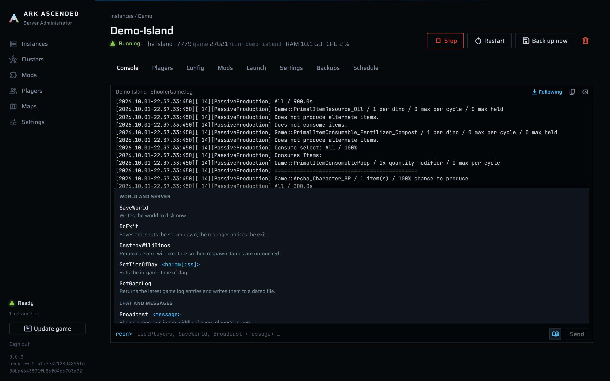

# Console and RCON

Every instance page opens on its **Console** tab: a live tail of the server's `ShooterGame.log` with
the manager's own notes mixed in, and an RCON input under it for sending commands to the running
server.

The panel follows the file `Instances\<slug>\ShooterGame\Saved\Logs\ShooterGame.log` about 200 ms
behind the game and shows each line as it appears. The server itself is started without a console
window and without output capture, so the log file is the only source. Manager lines (`Launched pid
...`, `RCON: doexit`, `Config: ...`) are interleaved with a different tone. The input at the bottom
sends one RCON command per press of Enter and echoes the reply into the same panel.

The Setup page uses the same panel for SteamCMD's output, without an input.

## The panel

The bar shows the title (`<instance name> · ShooterGame.log`), tags, and three controls:

| Control | Effect |
|---|---|
| **Following** / **Follow** | Toggles auto-scroll to the newest line. Scroll up to read, click **Follow** to snap back. |
| Copy icon (`Copy visible lines`) | Copies the visible lines to the clipboard, each prefixed with its time. |
| Clear icon (`Clear this view (the log itself is untouched)`) | Empties the panel in this browser tab only. |

Tags: `re-attached, log history` when some lines are history read from the log after a service
restart rather than observed live; `last 800 of 2000 lines` when the buffer holds more than the panel
renders. The panel keeps up to 5000 lines per instance in memory; older ones fall off.

Lines that start with `[` are the game's own, already stamped by the game; every other line gets the
manager's clock in front of it. Empty panel: `No output yet. Start the instance and the log appears
here within a second of the game writing it.`

## The startup markers

Three log lines drive the hint under the **Starting** state and the state's progress:

| Log line contains | Marker | State hint |
|---|---|---|
| `Full Startup:` | World loaded | `World loaded, waiting to advertise.` |
| `Server has completed startup and is now advertising for join` | Advertising | `Advertising, waiting for RCON.` |
| `Log file closed` | Clean shutdown | (the process exits shortly after) |

Before the first marker the hint is `Loading the world.` The line `Server: "..." has successfully
started!`, which the game prints a few seconds in, means nothing yet: the world is not loaded, and
the manager ignores it. Markers only advance the **Starting** phase; **Running** is decided by the
RCON probe, which succeeds soon after the advertising line.

Each live line is also classified for the player tracker, which reads join and leave lines from the
same tail ([players-and-whitelists.md](players-and-whitelists.md)).

## Sending a command

The input is enabled only while the instance has a live process (`Start the instance to send
commands` otherwise). Type a command, press Enter or **Send**. The command is echoed as `> ListPlayers`,
the reply follows line by line, or `(no reply)`. Anything the game's RCON accepts goes through
unchanged.

While you type the first word, a list opens above the input with the commands that match: names that
start with what you typed come first, then names that merely contain it. Each row shows the name, the
arguments it takes, and a line on what it does. Tab or a click puts the top match (or the row you
moved to with the arrow keys) into the input, followed by a space when the command takes arguments,
and leaves the cursor in the input. Escape closes the list. Once you type a space after the name, the
list gives way to a one-line reminder of that command's arguments.

The book button at the right of the input opens the whole list, grouped into world and server,
chat and messages, and players. It works while the server is stopped too, so you can look a command
up before starting it.

The list holds the commands most admins reach for, and only ones that work over RCON on ASA. Players
are named by EOS id, the 32-character id `ListPlayers` prints, never by Steam id. `BanPlayer` and
`UnbanPlayer` show an amber note, in the list and in the reminder line alike, that they act on every
managed instance on this machine, not just this one, because all of them share one ban list
([players-and-whitelists.md](players-and-whitelists.md#bans-apply-to-the-whole-box)). A command that
is not in the list can still be typed and sent.

| Key | List closed | List open |
|---|---|---|
| Enter | Sends the command. | Sends what is typed. If you moved onto a row with the arrow keys, puts that row in the input instead of sending. |
| Tab | Moves the focus on, as anywhere else. | Takes the highlighted row, or the top one. |
| Arrow up | Steps back through earlier commands. | The same, unless you are moving through the list: then one row up, and from the top row back to the input. |
| Arrow down | Steps forward through earlier commands; past the newest, brings back what you had typed. | From the input, moves onto the first row; then one row down. |
| Escape | Nothing. | Closes the list. |

Earlier commands belong to the instance, not to the browser tab. They are kept in
`Instances\<slug>\rcon-history.txt`, so a reload, another browser, or a service restart still finds
them: the newest 200, one per line with the oldest first, and a command sent twice in a row is kept
once. A command is recorded after it is sent, also when the send fails, so you can bring it back with
arrow up and try again. Commands the manager sends on its own (the liveness probe, scheduled actions,
the save before a backup) are never recorded, and neither is anything over 512 characters.

The file sits beside the instance's `Config` folder, outside what a backup archives and what a restore
replaces, and it goes away when the instance is deleted. You can edit or empty it by hand; blank
lines and repeats are skipped when it is read. If a stop, backup, or other operation has the
instance busy at the moment you send, that one command is not written to the file, though the arrow
keys still reach it until you leave the page.

A failure is appended to the console as `RCON Connect: ...` and shown as a toast.

### The commands the manager sends itself

| Command | What it does | Reply |
|---|---|---|
| `ListPlayers` | Who is on. The manager sends it every 15 s as the liveness probe, and the **Players** tab sends it on demand. | One line per player, or `No Players Connected` |
| `saveworld` | Writes the world file now; a backup starts with it. | `World Saved` |
| `broadcast <message>` | A message to every player; the stop countdown uses it. | (none) |
| `doexit` | Saves and exits the server. **Stop** sends it; typing it yourself skips the countdown and the manager still notices the exit. | `Exiting...` |

A stop shows its own commands in the panel as `RCON: broadcast Server shutting down in 1 minute.`,
`RCON: broadcast Server shutting down now.`, `RCON: doexit`, each with its reply, then
`Server exited (code -1).` from the liveness poll ([instances.md](instances.md#stop)).

### One connection per command

Each command opens a new connection to `127.0.0.1:<RCON port>`, authenticates with the
`ServerAdminPassword` from the generated `GameUserSettings.ini`, sends, reads, and closes. The whole
exchange is bounded by **RCON command timeout, seconds** (Settings, 10 by default); the hint there
warns that `Commands take 2 to 7 seconds while a server is still starting.`

A fresh connection each time is the point: the server is slow to authenticate (5 to 7 s) until it is
advertising, and holding a socket open across that gains nothing while making a failure harder to
attribute.

### The liveness probe

Every 15 s while a process is alive, the manager sends `ListPlayers` over RCON. The first success
moves **Starting** to **Running** and stamps the time; ten minutes without one becomes **Starting,
unconfirmed** (launched here) or **Unreachable** (re-attached). Probe failures are not shown in the
console.

## How the tail keeps up

Every 100 ms the manager opens the log with shared read, write, and delete access, reads whatever
appeared after its last offset, and splits it into lines. It detects rotation (the game renames the
previous log about a second into a new launch) by the NTFS file id or a shrinking length, and
restarts at offset 0 of the new file. On a fresh launch it starts at the end of any old log so the
previous session is not replayed; on re-attach it reads the last **Console history on re-attach,
lines** (Settings, 200 by default) as history, then follows. `LogSentrySdk:` lines and their
continuation lines are dropped before they reach the panel.

The Phase 2 spike tried stdout capture (`-stdout -FullStdOutLogOutput`) and settled on the tail: the
file is what the game writes anyway, it survives a service restart (a re-attached instance gets
history, a captured pipe would be gone), and the measured latency was around 200 ms. The startup
markers came from the same spike.

## Why RCON never leaves the box

The admin password crosses an RCON connection in plain text, and RCON gives full control of the
server. So the client always connects to `127.0.0.1`, no firewall rule is written for the RCON port,
and the web UI (which sits behind HTTPS and the login) is the way to reach it remotely.

## When a command does not go through

| Where | Message | Meaning and what to do |
|---|---|---|
| Toast `Command not sent` | `Type a command first.` | Empty input. |
| Toast `Command not sent` | `The instance is not running, so there is nothing to send the command to.` | No live process. |
| Toast `Command not sent` | `The generated GameUserSettings.ini is missing, so the RCON password is unknown.` | The file under `Saved\Config\WindowsServer` was deleted while the server ran. Stop (it will skip `doexit` and kill after the timeout) and start again. |
| Toast `Command not sent` | `ServerAdminPassword under [ServerSettings] is missing or empty; ...` or `RCONPort under [ServerSettings] is missing or invalid (was '...').` | The generated file has no usable credentials; fix the source and restart. |
| Toast and console | `RCON connect failure: RCON on port 27020 could not connect: ...` | Nothing is listening: the server is still starting, or `RCONPort` in the generated file is not the port it listens on. |
| Toast and console | `RCON authentication failure: RCON on port 27020 rejected the password.` | The password the generated file has is not what the server accepted at launch; restart the instance so both agree. |
| Toast and console | `RCON timeout failure: RCON 'ListPlayers' on port 27020 exceeded 10 s.` | Slow server or a command that never answers. Raise the timeout in Settings while a server is loading. |
| Toast and console | `RCON protocol failure: ...` | Anything else the client could not interpret. |
| Console | `Log tail stopped: ...` | The tail loop threw; the state is still tracked by the liveness poll. Restart the instance to get the console back. |
| Console | `Cannot probe RCON: <problem> Check ServerAdminPassword / RCONPort; the process is still watched for exit.` | On re-attach, no credentials could be read; the state is **Unreachable**. |
| Console | `RCON 'doexit' failed (Connect): ... Continuing with the next step.` | During a stop; nothing took the command, so the job kills the process straight away instead of waiting the graceful timeout out (`doexit was not acknowledged; killing pid <n> now ...`). |
| Console | `Server exited unexpectedly (code <n>).` | An exit the manager did not ask for. The log above it is the evidence. The server is restarted only if **Restart automatically after an unexpected exit** is on for the instance. |
| Console | `Restarting after unexpected exit (n/3).` | Automatic restart is relaunching the server after a 5-second pause. |
| Console | `The server exited unexpectedly again after 3 automatic restarts; automatic restart gave up. Start it to try again.` | Three restarts in a row each ended within 10 minutes. The state is **Crashed** until you press **Start**. |
| Console | `Automatic restart was refused: <reason>` | The relaunch hit a problem such as a port conflict or a missing executable. The state is **Crashed** with that reason. |
| Console | `Automatic restart skipped: <reason>.` or `Automatic restart skipped: another operation is using this instance.` | Nothing was relaunched, for example because an update or a restore was running, or another operation held the instance for 2 minutes. The state stays **Stopped**. |
