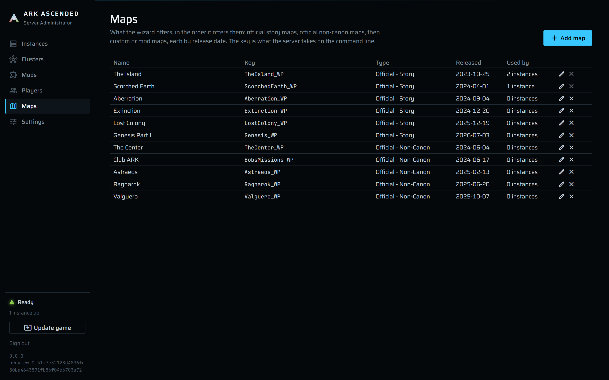

# Maps

The **Maps** page is the list the instance wizard offers. Each row is a map key (what the server
takes as the first argument on its command line, such as `TheIsland_WP`), a display name, a type,
a release date, and, for a custom map, the CurseForge id of the mod that ships it. Adding a new map,
official or custom, is a row on this page, not a new release of the manager.

## The map list



The columns are **Name**, **Key**, **Type** (`Official - Story`, `Official - Non-Canon`, or
`Custom/Mod`, with "mod id *N*" under a custom map), **Released**, **Used by** (*N* instances), and
edit and delete buttons. Delete is disabled with the tooltip "In use" while any instance runs the
map; otherwise it asks "The map is removed from the list. Nothing on disk changes."

Rows come in the one order the wizard uses too: official story maps, official non-canon maps, then
custom or mod maps, each group by release date with unknown dates last, then by name.

## Adding or editing a map

**Add map** (or the edit button) opens a dialog:

| Field | Meaning |
|---|---|
| **Map key** | "Exactly what the server takes on the command line." No spaces, no `?` or `=`. |
| **Display name** | What the wizard and the instance rows show. |
| **Release date** | "Lists sort by type, then this date, then name. Leave it empty if unknown." |
| **Official** | Ticked for the maps that ship with the game. |
| **Story map** | Only enabled when **Official** is ticked. |
| **Map mod (CurseForge project id)** | Shown only when **Official** is not ticked. "Required. Added to the mod library and loaded first on every instance using this map; it never appears in the instance or cluster mod lists. Change it here if the map is re-released under a new id." |

**Add map** / **Save map** commits; a toast says "Saved *name*" or "Could not save the map" with
the reason.

Saving checks the key (required, at most 100 characters, no whitespace, usable on the command line)
and the name (required, at most 100 characters), forbids a story flag without the official flag,
forbids a mod id on an official map, requires one on a custom map, and refuses a second map with the
same key (case-insensitive).

A custom map whose mod id is not yet in the library adds it on save: through CurseForge (name,
summary, thumbnail) when an API key is set, otherwise as a manual entry named after the map. That
mod is then excluded from every cluster and instance mod list, and every list save is checked
against the `Maps.ModId` column ([mods.md](mods.md)). The mod that ships a map is a property of the
map: the game must load it first and every instance on the map needs it, so the manager takes it
from the chosen map instead of asking you to remember it on every cluster and instance.

## The maps that ship with the game

The official maps are seeded on first run with their key, name, story flag, and ASA release date,
and checked again on every service start. The seed matches on the key, so a map added to a newer
build reaches an existing database at the next start. The story flag and the release date are
re-applied every start, because those are facts about the map; the display name is yours to change
and stays as you left it.

The official seed as of this version:

| Key | Name | Type | Released |
|---|---|---|---|
| `TheIsland_WP` | The Island | Story | 2023-10-25 |
| `ScorchedEarth_WP` | Scorched Earth | Story | 2024-04-01 |
| `TheCenter_WP` | The Center | Non-Canon | 2024-06-04 |
| `BobsMissions_WP` | Club ARK | Non-Canon | 2024-06-17 |
| `Aberration_WP` | Aberration | Story | 2024-09-04 |
| `Extinction_WP` | Extinction | Story | 2024-12-20 |
| `Astraeos_WP` | Astraeos | Non-Canon | 2025-02-13 |
| `Ragnarok_WP` | Ragnarok | Non-Canon | 2025-06-20 |
| `Valguero_WP` | Valguero | Non-Canon | 2025-10-07 |
| `LostColony_WP` | Lost Colony | Story | 2025-12-19 |
| `Genesis_WP` | Genesis Part 1 | Story | 2026-07-03 |

## Choosing a map in the wizard

The *Map* step shows the same list grouped by type, each entry with its key, "released *date*", and
"mod id *N*" for a custom map; The Island is preselected. The wizard's lead text: "Official story
maps first, then official non-canon maps, then custom or mod maps, each in release order. Add others
on the Maps page." A custom map's mod then appears locked at the top of the *Mods* step. See
[instance-creation.md](../instance-creation.md).

## What a map key does at launch

The map key becomes the first token of the command line, with `?listen` and
`?AltSaveDirectoryName=<slug>` appended, and the map's mod id becomes the first entry of `-mods=`:

```
TheIsland_WP?listen?AltSaveDirectoryName=my-island -port=7777 ... -mods=<map mod>,<cluster mods>,<instance mods>
```

The world the server writes lives under `Instances\<slug>\ShooterGame\Saved\<slug>\<MapKey>\`, and
the backup job looks for `<MapKey>.ark` in exactly that folder.

## Changing a map an instance already runs

The instance page has no map field; the map is chosen in the wizard and stays with the instance.
Editing a map row (its key, name, or mod id) applies to every instance on it at their next start.

Maps are rows in the `Maps` table (`Key`, `Name`, `IsOfficial`, `IsStory`, `ReleaseDate`, `ModId`)
and an instance references a map by id, so renaming a map changes what the rows show and nothing
else. Changing a row's **Map key** is a different matter: the instances on it launch a different map
next time, their existing world (saved under the old key's folder) is not loaded by the new one, and
the backup job will report `world file missing` until the new map saves. To move a world to another
map you create a new instance on that map.

## What the dialog will not accept

| Message | Meaning and what to do |
|---|---|
| `Map key is required; it is the name passed on the command line, e.g. TheIsland_WP.` | Fill in the key. |
| `Map key must be 100 characters or fewer.` / `Map name must be 100 characters or fewer.` | Shorten it. |
| `Map key must not contain spaces.` | Keys are single tokens. |
| `Map key must not contain '?'.` / `Map key must not contain '='.` | The key would break the `?`-delimited map string. |
| `Map name is required.` | Fill in the display name. |
| `Only an official map can be a story map.` | Untick **Story map** or tick **Official**. |
| `An official map has no map mod; clear the mod id or untick Official.` | The dialog hides the field for official maps; this appears only if a stale value was submitted. |
| `A custom map needs the CurseForge project id of the mod that ships it.` | Fill in **Map mod**. |
| `A map with key '<key>' already exists.` | Edit the existing row instead. |
| `CurseForge rejected the API key. ...` / `CurseForge could not be reached: ...` | The map mod could not be fetched; the manager falls back to a manual library entry named after the map, so this surfaces only if that fails too. |
| `Instances still use this map: <names>.` | Delete or re-create those instances first; a map in use cannot be deleted. |
| `The map was deleted while you were editing it.` | Another session removed the row. Reload. |
| Wizard: `Choose a map.` | The *Map* step was skipped or the chosen row was deleted. |
