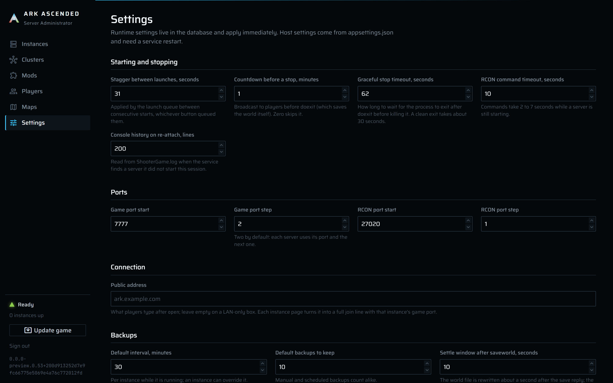
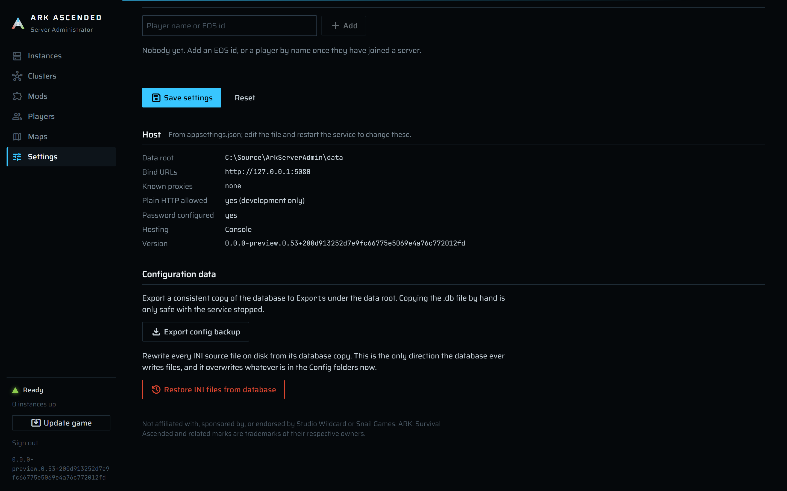

# Settings and export

The **Settings** page holds the App Settings that live in the database and apply immediately when
saved, shows the host settings that come from `appsettings.json` read-only, prints the app version
and the disclaimer, and has two buttons that act on the configuration data: **Export config
backup**, which writes a consistent copy of the database, and **Restore INI files from database**,
which rewrites every INI source file on disk from its database mirror.

## Why there are two kinds of setting

The page lead says it: "Runtime settings live in the database and apply immediately. Host settings
come from appsettings.json and need a service restart."

Anything the host needs before it can serve a page (where it listens, where `DataRoot` is, the login
password) is in the file and read once at startup. Everything the running manager consults while it
works is in SQLite, where the UI can edit it. Every path in the database is relative to one
`DataRoot`, so the database restores onto another box.

## App Settings

| Section | Field | Default | Range or rule |
|---|---|---|---|
| Starting and stopping | **Stagger between launches, seconds** | 30 | 0 to 3600 |
| | **Countdown before a stop, minutes** | 1 | 0 to 60; zero skips the broadcast |
| | **Graceful stop timeout, seconds** | 60 | 5 to 3600 |
| | **RCON command timeout, seconds** | 10 | 1 to 300 |
| | **Console history on re-attach, lines** | 200 | 0 to 5000 |
| Ports | **Game port start** / **Game port step** | 7777 / 2 | 1 to 65535 / 1 to 1000 |
| | **RCON port start** / **RCON port step** | 27020 / 1 | 1 to 65535 / 1 to 1000 |
| Backups | **Default interval, minutes** | 30 | 1 to 10080 |
| | **Default backups to keep** | 10 | 1 to 1000 |
| | **Settle window after saveworld, seconds** | 10 | 1 to 600 |
| Game install | **SteamCMD validate** | off | Adds `validate` to every install and update |
| | **CurseForge API key** | empty | No whitespace or control characters; trimmed on save |
| Admin whitelist | the whitelist editor | empty | One id per line, no spaces |
| Connection | **Public address** | empty | One host name or IP, no spaces and no scheme; up to 253 characters |

Each field's hint on the page says what it feeds; the pages that use them are
[instances.md](instances.md) (stagger, countdown, timeouts, backfill, ports),
[backups.md](backups.md), [game-updates.md](game-updates.md), [mods.md](mods.md), and
[players-and-whitelists.md](players-and-whitelists.md).

**Save settings** validates every value and writes; if anything fails, the problems appear under the
form and nothing at all is written. The button shows "Saving…" for about two seconds so the click
visibly did something, then a toast says "Saved settings". **Reset** reloads the stored values and
discards edits. Every save carries the version the page loaded; if another save landed first (a second
tab, or a background change), the page keeps your edits, shows "The settings changed since they were
loaded ... reload the page and try again", and writes nothing. Press **Reset** to load the current values
and save again.

The values are rows in the `AppSettings` table, one per key, decoded into one settings object that
is cached in memory after the first read and replaced on save. A `Version` row counts the writes; a save
that changes nothing does not count. A save updates or inserts every changed row
in one `SaveChanges`, then swaps the cached object. Because the cache is replaced, every
consumer (the launch queue, the port allocator, the backup scheduler, the CurseForge handler that
adds the `x-api-key` header) sees the new value on its next call, with no restart.

**Public address** is the one field nothing on this box can work out for itself: the name or address
players outside your network type after `open`, so a DNS name that points at your router or the
router's own address. Leave it empty on a LAN-only box. Nothing resolves it or contacts it; each
instance page simply joins it to that instance's game port to show a ready-made join line
([instances.md](instances.md#connection)).

The CurseForge key is stored as it is typed because, as the hint on the field says, it is your own
key on your own box and it is only ever sent to CurseForge; the folders that hold the database and
its copies are locked down by the installer instead.

## Host

"From appsettings.json; edit the file and restart the service to change these."

| Row | Value |
|---|---|
| **Data root** | The resolved `DataRoot`. |
| **Bind URLs** | Every Kestrel endpoint URL. |
| **Known proxies** | The reverse-proxy addresses, or `none`. |
| **Plain HTTP allowed** | `yes (development only)` or `no`. |
| **Password configured** | `yes`, or `no: every login is refused`. `yes` means a usable credential: `ArkAdmin:Password` or a well-formed `ArkAdmin:PasswordHash`. |
| **Hosting** | `Windows service` or `Console`. |
| **Version** | The assembly's informational version, `1.0.0+<commit sha>` for a release build. The same string sits at the bottom of the sidebar on every page. |

These are read once at startup from `appsettings.json` (plus `appsettings.Production.json` and
environment variables) into a read-only record, and the page shows that record. The password is the
one exception: the credential follows configuration reloads, so a changed `Password` or
`PasswordHash` invalidates every cookie on its next request and every circuit at its next
revalidation without a restart, while the **Password configured** row still shows the value from
startup.

[configuration.md](../configuration.md) explains each host setting and how to change it.

## Export config backup

"Export a consistent copy of the database to `Exports` under the data root. Copying the .db file by
hand is only safe with the service stopped." The toast "Exported config backup" carries the path,
and the page shows "Written to *path*".

The button opens a second SQLite connection to `DataRoot\Exports\config-yyyyMMdd-HHmmss.db.tmp`,
runs SQLite's online backup API from the live connection into it (consistent even with
write-ahead-log traffic in flight), closes it, and renames it to `config-yyyyMMdd-HHmmss.db`
(local time). Nothing else is written. A raw copy of a SQLite database that is being written is not
a consistent file, which is the whole reason this button exists: you never have to stop the service
to keep a copy of your configuration.

The file is a complete copy of the database: clusters, instances, maps, the mod library and
assignments, the INI text mirrors, overrides, known players, backup records, the maintenance state,
and every App Setting, **including the CurseForge API key in plain text**. The installer restricts
`DataRoot\Exports` to `SYSTEM` and administrators for that reason.

No import button exists; to use an export you stop the service, replace
`DataRoot\Data\ArkAscendedServerAdmin.db` (and delete any `-wal` and `-shm` next to it), and start
the service again. The installer's own database copies during an upgrade are a different thing
([backups.md](backups.md#the-installers-backups_app-copies)).

## Restore INI files from database

"Rewrite every INI source file on disk from its database copy. This is the only direction the
database ever writes files, and it overwrites whatever is in the Config folders now." It asks first:
"Every Game.ini and GameUserSettings.ini under Clusters\*\Config and Instances\*\Config is
overwritten with the database copy. Unsaved edits on disk are lost." Confirm with **Overwrite the
files**.

It reads every row of `IniDocuments` (cluster or instance owner, file, text) and writes each one
atomically to its source path, `Clusters\<slug>\Config\<file>` or `Instances\<slug>\Config\<file>`.
It does not touch the generated files under `ShooterGame\Saved\Config\WindowsServer`, which are
rewritten from the source at the next start; see
[configuration-files.md](configuration-files.md).

At the bottom of the page: "Not affiliated with, sponsored by, or endorsed by Studio Wildcard or
Snail Games. ARK: Survival Ascended and related marks are trademarks of their respective owners."
The version and the disclaimer are here because Settings is the one page every owner opens at least
once.

## What can go wrong here

| Where | Message | Meaning and what to do |
|---|---|---|
| Save settings | `<Name> must be between <min> and <max> (was <n>).` for any numeric field, for example `StaggerDelaySeconds must be between 0 and 3600 (was 5000).` | Fix the field. Nothing was saved. |
| Save settings | `CurseForgeApiKey must not contain whitespace or control characters.` | Re-paste the key without spaces or line breaks. |
| Save settings | `AdminWhitelist must hold one id per line with no spaces.` | Fix the offending line in the whitelist editor. |
| Save settings | `PublicAddress must be one host name or IP address with no spaces.`, `PublicAddress must not include a scheme such as steam:// or https://.`, or `PublicAddress must be at most 253 characters (was <n>).` | Type just the name or address players use, for example `ark.example.com` or `203.0.113.9`. |
| Save settings | `The settings changed since they were loaded (version <n> is behind <m>); reload the page and try again.` | Another save landed after this page loaded. Press **Reset**, re-apply the edit, save again. Nothing was written. |
| Export | The toast is missing and an error page or notification appears | `DataRoot\Exports` could not be written (disk full, or the folder ACL changed). Check the service log ([troubleshooting.md](troubleshooting.md#where-every-log-lives)). |
| Restore | `Restore failed: <error>` | A source file could not be written, typically a folder that no longer exists because the instance was deleted outside the manager, or a permission problem. The message is the OS error. |
| Host | **Password configured** shows `no: every login is refused` | Neither `ArkAdmin:Password` nor a well-formed `ArkAdmin:PasswordHash` is set. Run `install.ps1 -SetPassword` ([hosting.md](../hosting.md#changing-the-password)). |
