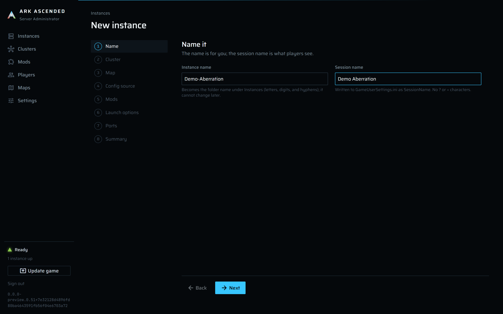
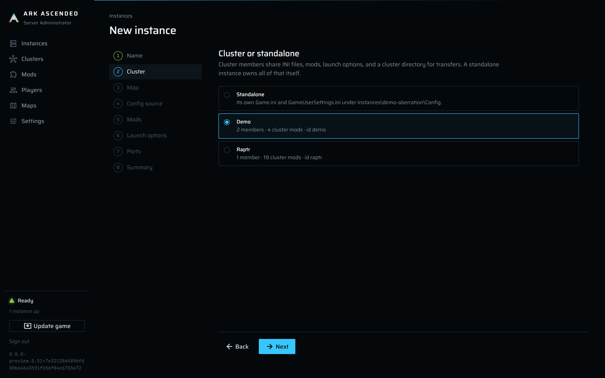
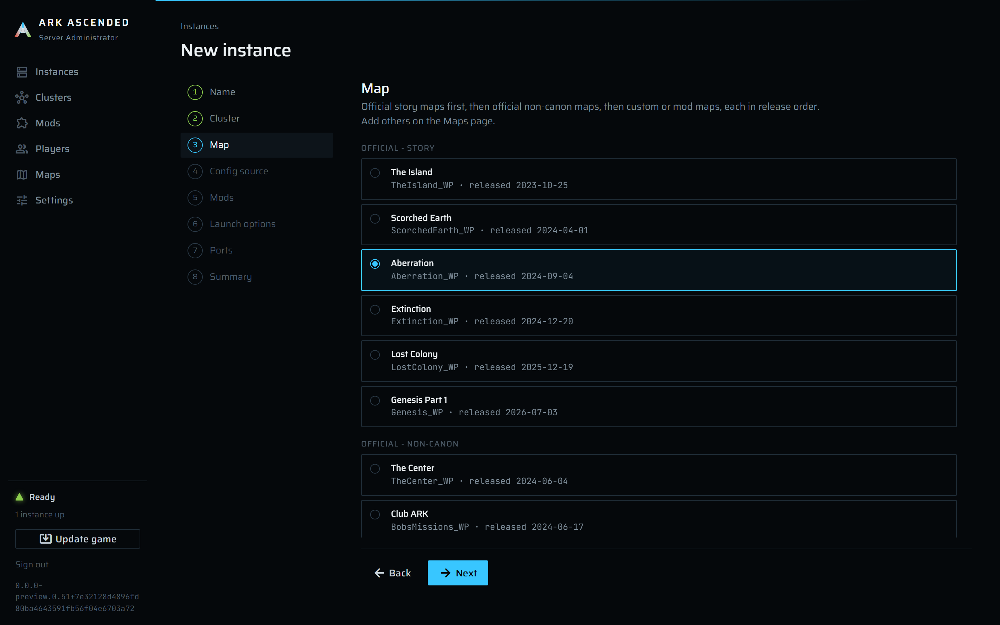
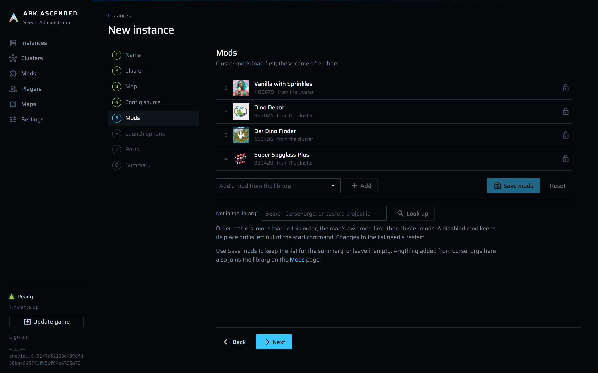
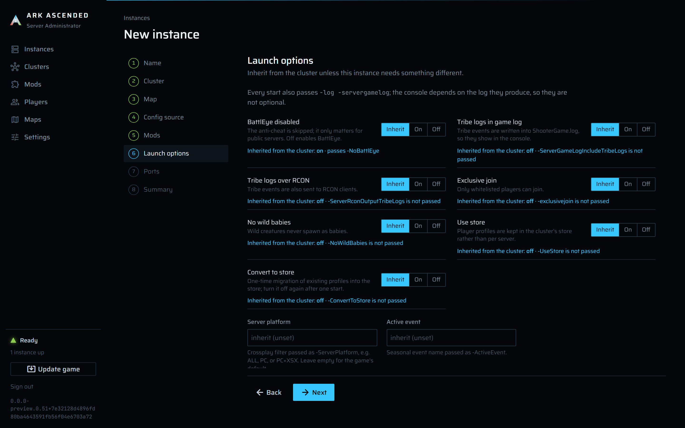
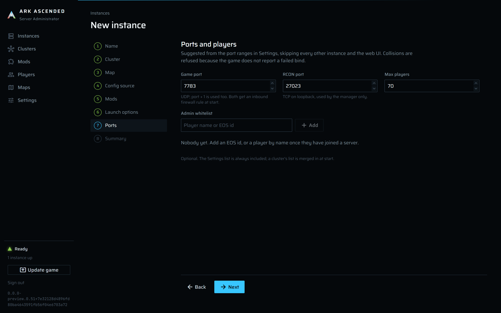
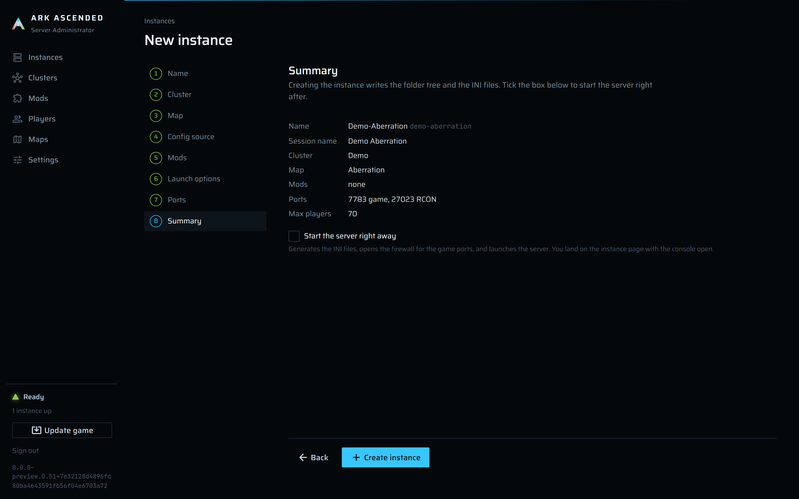

# What happens when you create an instance

The **New instance** wizard collects a handful of answers and then does all the work in one go, after
the last click. Paths are relative to the `DataRoot` configured in `appsettings.json` (for example
`C:\Ark`).

## What the wizard collects

| Step | You choose | Notes |
|---|---|---|
| Name | Instance name, session name | The name becomes the folder name (the slug, e.g. `My Island` → `my-island`) and cannot change later. The session name is what players see in the server browser. |
| Cluster | Standalone or a cluster | Members share the cluster's INI files, mods, base launch options, whitelist, and a cluster directory for transfers. |
| Map | One of the map rows | Official maps are seeded; custom maps are rows on the Maps page. |
| Config source | Where the two INI files start from, and the server admin password | Standalone only. Game defaults, blank, or a copy of another instance's or cluster's current source text. The password is required before the first start because RCON is how the manager saves and stops the server. |
| Mods | Ordered CurseForge ids | A custom map's own mod loads first, then cluster mods, then these. The map mod is set on the map and cannot be listed here. The list is picked from the mod library, and "Not in the library?" under it adds a CurseForge mod to the library and to the list without leaving the wizard ([mods.md](guide/mods.md)). |
| Launch options | Typed `-Flag` values and free-text extra arguments | Members can inherit from the cluster per flag. Reserved options (`-port`, `-mods`, `-clusterid`, ...) are rejected in free text. |
| Ports | Game port, RCON port, max players, admin whitelist | Suggested from the port ranges in Settings, skipping every other instance and the web UI's own port. |
| Summary | Review, then **Create instance**, optionally with **Start the server right away** | |

The steps, as they look when adding an Aberration server to a cluster named Demo (the Config source
step is left out: for a cluster member it has nothing to choose):

**Name**



**Cluster**



**Map**



**Mods**



**Launch options**



**Ports**



**Summary**



## Clicking "Create instance"

Everything below runs inside one call to the instance command facade. Steps 1 to 4 touch only the
database; nothing is on disk until step 5.

1. The call is refused if the login cookie or the Blazor circuit is no longer valid, regardless of
   what the page showed.
2. Validation happens all at once. Name required and unique (case-insensitive); session name required
   and free of `?`, `=`, and line breaks; max players 1 to 500; typed flags and extra arguments
   free of reserved options and `?`; backup interval and retention in range when set; map exists;
   cluster exists when chosen; every mod id is in the library; admin password free of line breaks;
   game port, game port + 1, and RCON port free of every other instance's ports and of the web UI's
   port. Any problem stops here and is listed under the summary.
3. The slug comes from the name: lower-cased, non-alphanumerics become hyphens, and a numeric suffix
   is added if the result collides with a live instance, a cluster, or a retained world under
   `Archive\` (deleted instances keep their slug reserved while their world data is kept).
4. `Instances` gets the row (name, slug, cluster, map, session name, ports, max players, whitelist,
   launch flags, backup overrides, `CreatedAt`), and `InstanceMods` one row per mod in the order you
   chose. State is `Stopped`.
5. `Instances\<slug>\` is created with NTFS junctions into the shared game install and one real
   directory:

   ```
   Instances\<slug>\
     Engine\                      -> junction to Server\Engine
     ShooterGame\Binaries\        -> junction to Server\ShooterGame\Binaries
     ShooterGame\Content\         -> junction to Server\ShooterGame\Content
     ShooterGame\Plugins\         -> junction to Server\ShooterGame\Plugins
     ShooterGame\Saved\           real directory (this instance's private world, logs, generated config)
   ```

   Junctions are created through the Windows reparse-point API (no `mklink`, no elevation
   requirement). The step is idempotent: a junction that already points at the right target is
   left alone, a wrong one is repaired. Every instance therefore runs the same binaries through its
   own path, which is how the manager tells processes apart and how each instance gets its own
   `Saved`.
6. The INI source files are written for a standalone instance; a member uses the cluster's.
   `Instances\<slug>\Config\` gets `Game.ini` and `GameUserSettings.ini` from the source you chose.
   If you typed an admin password it is set as `ServerAdminPassword` under `[ServerSettings]`,
   replacing whatever the source had. Each file is written temp-and-rename and mirrored into the
   `IniDocuments` table with its SHA-256, so a copy of the database is a complete configuration
   backup and the INI editor can detect concurrent edits.
7. If step 5 or 6 throws (a file in the way, a copy source that no longer exists, a disk error), the
   row from step 4 is removed again and the error is shown. Nothing half-created is left in the
   database.
8. You land on the instance page. Without the start option that is all: no firewall rule, no
   generated config, no process, and nothing under `ShooterGame\Saved` yet.

## "Start the server right away"

The option is the same code path as the **Start** button on the instance page, triggered once you
arrive there. It is a long operation, so the page fires it in the background and reports the
outcome as a toast; the console shows the details.

1. The start is refused unless the service is `Ready` (game install verified); refused while an
   update or install holds the maintenance gate; refused while another operation (stop, backup,
   delete) holds this instance's lock; refused if the instance already has a live process.
2. Launches are serialized with a stagger delay between them (Settings → **Stagger delay**, 30 s by
   default) so several servers do not fight over the disk. A first launch does not wait.
3. The folder tree is re-checked (step 5 above), so a manually deleted junction is repaired.
4. The manager reads the source INI files (the cluster's for a member), applies the instance's extra
   overrides, and writes the files the game actually reads:

   ```
   Instances\<slug>\ShooterGame\Saved\Config\WindowsServer\Game.ini
   Instances\<slug>\ShooterGame\Saved\Config\WindowsServer\GameUserSettings.ini   (+ .bak of the previous one)
   Instances\<slug>\ShooterGame\Saved\AllowedCheaterAccountIDs.txt               (cluster whitelist ∪ instance whitelist)
   ```

   The instance's own fields are written into `GameUserSettings.ini`: `SessionName`, `Port`,
   `RCONPort`, `RCONEnabled=True`, `MaxPlayers`. If the source text also contained one of those
   keys it is replaced and a warning line goes to the console. Generated files are never read back
   as source; the game rewrites `GameUserSettings.ini` on its own at launch and exit and that never
   leaks into your source text.
5. The RCON credentials are read back from the generated `GameUserSettings.ini`. An empty
   `ServerAdminPassword` refuses the start with a message naming it; RCON is the only stop path,
   so the manager will not launch a server it cannot ask to save and exit.
6. Ports are checked again, this time also against the operating system's live UDP and TCP listener
   tables. A collision refuses the start, because the game does not report a failed bind; the server
   just never becomes reachable.
7. Two inbound UDP allow rules named `ArkAscendedServerAdmin-<tag>-<instance id>` are created (or
   repaired) for the game port and game port + 1, on all profiles. The tag is eight characters
   derived from the data folder; it identifies the installation, so two installs on one machine
   keep separate rules even when their instance ids match. The instance page's Connection card
   shows the exact name. If the firewall API fails, the start continues with a warning in the
   console telling you which ports to open by hand. RCON stays on loopback and gets no rule.
8. The command line is built from the row, never from a shell string:

   ```
   <MapKey>?listen?AltSaveDirectoryName=<slug>
   -port=<game port>
   -WinLiveMaxPlayers=<max players>          (ASA ignores the INI MaxPlayers; this flag is authoritative)
   -clusterid=<cluster key> -ClusterDirOverride=<DataRoot>\Clusters\<cluster slug>    (members only)
   -mods=<map mod>,<cluster mods>,<instance mods>   (when any)
   -log -servergamelog
   <typed flags, e.g. -NoBattlEye unless BattlEye was enabled>
   <extra arguments verbatim>
   ```

   The **Launch options** tab shows this exact line as a preview before you start. The slug rides
   in the map string as `AltSaveDirectoryName`, which both keeps the world under
   `Saved\<slug>\<MapKey>\` and is the token the manager uses to recognize the process again after
   a service restart.
9. `Instances\<slug>\ShooterGame\Binaries\Win64\ArkAscendedServer.exe` is started through the
   junction path, without a console window and without stdout capture. The launch holds a shared
   lease on the maintenance gate from just before start until step 10 is done, so an update cannot
   slip in between.
10. The process id and its exact start time are written to the row (`LastPid`,
    `LastProcessStartTime`, state `Starting`), with three retries over about ten seconds. This pair
    is how a restarted service re-attaches to a server that kept running. If persistence keeps
    failing the server is left running and the instance shows `IdentityUnpersisted` with a
    **Retry persist** button.
11. From here on the manager only watches. The console tails `ShooterGame\Saved\Logs\ShooterGame.log`
    (about 200 ms behind the game) and recognizes the startup markers (`Full Startup` = world
    loaded, `advertising for join` = joinable, `Log file closed` = clean shutdown). An RCON probe
    runs every 15 s; the first success moves the instance to `Running`. Ten minutes without a
    success becomes `StartingUnconfirmed` (still alive, RCON never answered; check the password
    and RCON port). A liveness poll every 2 s notices an exit. Once `Running`, the backup scheduler
    includes the instance at its interval (Settings default, or the per-instance override).

## What is on disk afterwards

```
<DataRoot>\
  Server\                                   shared game install (SteamCMD target), never per instance
  Instances\<slug>\
    Config\Game.ini, GameUserSettings.ini    source text (standalone only; edited in the INI editor)
    Engine\, ShooterGame\{Binaries,Content,Plugins}\   junctions into Server\
    ShooterGame\Saved\
      Config\WindowsServer\*.ini             generated at every start (+ .bak)
      AllowedCheaterAccountIDs.txt           generated whitelist
      Logs\ShooterGame.log                   the console's source
      <slug>\<MapKey>\<MapKey>.ark, ...      the world (after the first save)
  Clusters\<cluster slug>\Config\*.ini       a member's source text lives here instead
  Backups\<slug>\*.zip                       verified world backups
```

## When it is refused

| Message | Meaning |
|---|---|
| `ServerAdminPassword under [ServerSettings] is missing or empty` | Set it on the Config source step, in the INI editor, or in the cluster's INI. |
| `The service is not ready yet (...)` | The game install is still being verified or downloaded; watch `/setup`. |
| `update in progress` | An update or install holds the maintenance gate; try after it finishes. |
| `operation in progress` | A stop, backup, or delete of this instance is still running. |
| `Port conflict: ...` | Another instance, the web UI, or an OS listener owns one of the three ports. |
| `Process.Start failed: ...` | The executable under the junction is missing or unreadable; check `Server\` and the junctions. |
| `... identity could not be saved after 3 retries` | Database write failed; the server is up, use **Retry persist**. |
